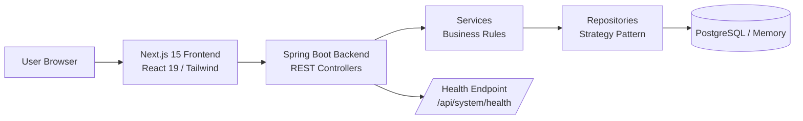
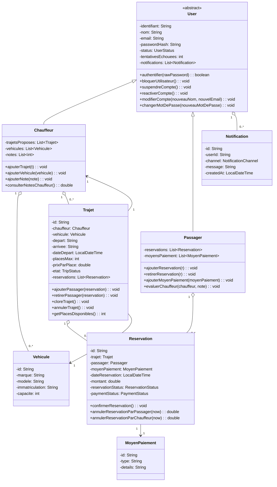
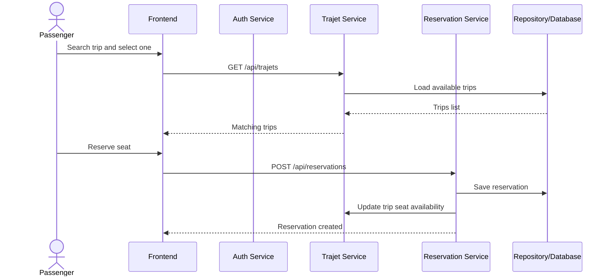

# Tawsila.tn Project Presentation

> Ready-to-use presentation outline for a Spring Boot + Web carpooling platform.

---

## 1. Title Slide

**UniRide**  
University Carpooling Platform  
Spring Boot + HTML/CSS/JavaScript + PostgreSQL

**Presenter:** Walid El Bassouri  
**Context:** Final project / academic presentation

---

## 2. Project Overview

### Problem
- Students and staff need a simple way to share rides.
- Existing travel coordination is often manual, slow, and fragmented.
- Reservation, payment tracking, and trip management need to be centralized.

### Solution
- Tawsila.tn is a web platform for creating, searching, booking, and managing carpool trips.
- It supports passagers, chauffeurs, and administrators.
- It can run in memory for testing or with PostgreSQL for production.

---

## 3. Objectives

- Allow users to register and log in securely.
- Let drivers publish trips with vehicle details.
- Let passengers search and reserve available seats.
- Manage reservation confirmation, cancellation, and payment status.
- Provide admin controls for user and platform management.
- Support deployment with a real database and health monitoring.

---

## 4. Main Features

- Authentication and account management.
- Trip creation and trip listing.
- Reservation creation, confirmation, and cancellation.
- Payment method management.
- Notifications for important actions.
- Administrative dashboard.
- Health endpoint for deployment monitoring.

---

## 5. Technology Stack

### Backend
- **Java 17**
- **Spring Boot 3.4+**
- **Spring Web / Actuator**
- **PostgreSQL / JDBC**

### Frontend
- **Next.js 15** (App Router)
- **React 19**
- **Framer Motion** (Smooth Animations)
- **Tailwind CSS 4**

### Deployment / DevOps
- **Docker** (Containerization)
- **Render** (Backend Hosting)
- **Vercel** (Frontend Hosting)

---

## 6. Architecture Overview

### Key Architectural Decisions
- **Layered Architecture:** Strict separation of concerns (Controller -> Service -> Repository).
- **Persistence Strategy Pattern:** Switchable storage backend (Memory/Postgres) via environment variables.
- **RESTful Design:** Stateless communication between frontend and backend.
- **Localization:** Integrated `next-intl` for multi-language support (FR, EN, AR).

---

## 7. OOP (Object-Oriented Programming) Principles

As a project for the **POO module**, Tawsila.tn implements core Java OOP concepts:

1. **Encapsulation:** All domain entities (`User`, `Trajet`, etc.) use private fields with controlled access and validation logic.
2. **Inheritance:** An abstract `User` base class provides common identity and security logic, specialized by `Passager`, `Chauffeur`, and `Admin`.
3. **Abstraction:** Business services interact with `Repository` interfaces rather than concrete implementations, allowing storage flexibility.
4. **Polymorphism:** The application dynamically chooses the correct repository implementation (In-Memory or Postgres) at runtime based on configuration.

---

## 8. UML Class Diagram

### What to explain
- `User` is the base abstract class.
- `Chauffeur` and `Passager` specialize user behavior.
- `Trajet` links a driver, a vehicle, and reservations.
- `Reservation` stores booking and payment status.
- `Notification` is used for alerts and account events.

---

## 8. Reservation Flow UML

### What to say
- The user first searches trips.
- Then the reservation is created through the API.
- The trip availability is updated automatically.

---

## 9. Backend Modules

### Controllers
- `AuthController`
- `TrajetController`
- `ReservationController`
- `AdminController`
- `UserDataController`
- `SystemController`

### Services
- `AuthService`
- `TrajetService`
- `ReservationService`
- `PaiementService`
- `NotificationService`
- `AdminService`
- `UserDataService`

### Repositories
- In-memory repositories for fast local execution.
- PostgreSQL-backed persistence for production mode.

---

## 10. API Summary

### Authentication
- `POST /api/auth/register`
- `POST /api/auth/login`
- `POST /api/auth/logout`
- `GET /api/auth/me`
- `GET /api/auth/users`

### Trips
- `POST /api/trajets`
- `GET /api/trajets`
- `POST /api/trajets/{id}/close`

### Reservations
- `POST /api/reservations`
- `POST /api/reservations/{id}/confirm?chauffeurId=...`
- `POST /api/reservations/{id}/cancel?initiateurId=...&initiateurChauffeur=true|false`
- `GET /api/reservations`
- `GET /api/reservations/passager/{passagerId}`
- `GET /api/reservations/passager/{passagerId}/suivi`
- `GET /api/reservations/chauffeur/{chauffeurId}/demandes`

### System
- `GET /api/system/health`

---

## 11. Persistence Strategy

### Memory Mode
- Default mode.
- Useful for local development and demos.
- No external database required.

### PostgreSQL Mode
- Recommended for deployment.
- Enabled with `APP_PERSISTENCE_MODE=postgres`.
- Uses `POSTGRES_URL`, `POSTGRES_USER`, `POSTGRES_PASSWORD`, and `POSTGRES_SCHEMA`.

### Why it matters
- Makes the project flexible during development.
- Supports real deployment on Railway.

---

## 12. Deployment on Railway

### Service setup
- Deploy the repository as a Railway web service.
- Add a Railway PostgreSQL database.
- Connect the backend service to that database.

### Environment variables
- `APP_PERSISTENCE_MODE=postgres`
- `POSTGRES_URL=jdbc:postgresql://<host>:<port>/<database>`
- `POSTGRES_USER=<user>`
- `POSTGRES_PASSWORD=<password>`
- `POSTGRES_SCHEMA=public`

### Commands
- Build: `mvn clean test`
- Start: `java -jar target/*.jar`

### Health check
- `/api/system/health`

---

## 13. Security and Reliability

- Passwords are hashed before storage.
- Account blocking after repeated failed logins.
- Session-independent API design with bearer token support on the frontend.
- Health endpoint for uptime checks.
- CORS can be enabled if the frontend is moved to another domain.

---

## 14. Demo Scenario

1. Register a passenger account.
2. Log in.
3. Search available trips.
4. Create a reservation.
5. Confirm or cancel the reservation.
6. View notifications and reservation history.
7. Show the admin or driver workflows.

---

## 15. Project Strengths

- Clear separation between frontend, backend, and persistence.
- Real business rules for reservations and trip availability.
- Flexible storage strategy.
- Ready for local demo and production deployment.
- Useful for academic presentation because it demonstrates architecture, API design, and data modeling.

---

## 16. Limitations and Future Work

- Add a richer UI framework for a more polished user experience.
- Introduce notifications through real email/SMS providers.
- Add map integration and geolocation.
- Improve analytics for admins.
- Add more automated tests for domain rules.

---

## 17. Conclusion

Tawsila.tn is a complete university carpooling platform that combines user management, trip publishing, reservation handling, and deployment-ready backend architecture.

It is a strong example of a full-stack Spring Boot project with clean modular design and real-world business rules.

---

## 18. Q&A

**Thank you for your attention.**  
Questions?
