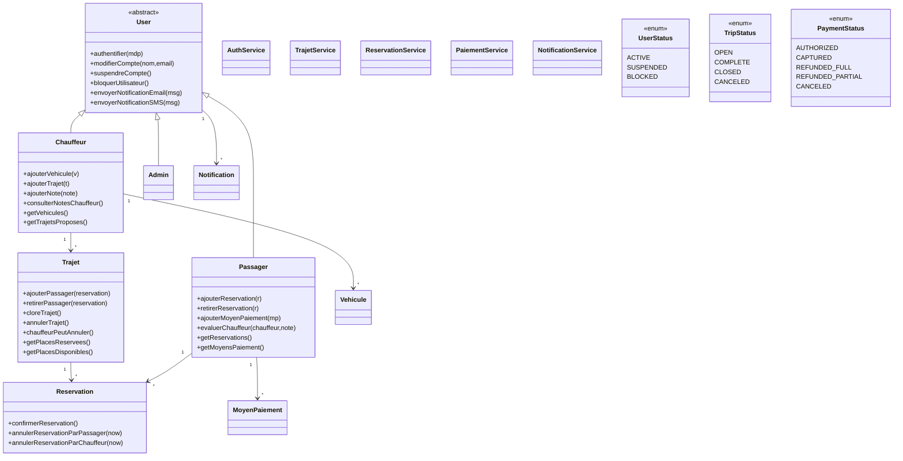

# UniRide - Plateforme de Covoiturage (Spring Boot + Web)

## 1) UML (Class Diagram)



## 2) Architecture

- Layered architecture:
  - `controller/`
  - `service/`
  - `repository/`
  - `model/`
  - `dto/`
  - `exception/`
- In-memory repositories (`Map`) for demo and university project scope.
- Encapsulation rules:
  - domain fields are private/protected
  - defensive copy for exposed collections
  - business logic stays in entities/services (no global mutable singleton state)

## 3) Business Rules Implemented

- User account
  - register as `PASSAGER`, `CHAUFFEUR`, `ADMIN`
  - blocked after failed login attempts (`MAX_FAILED_ATTEMPTS = 3`)
  - admin can suspend/block users
  - notifications tracked in user object (email + sms simulation)

- Trips
  - trip status becomes `COMPLETE` when last seat is reserved
  - driver cannot cancel trip with existing reservations

- Reservation & payment
  - payment authorized at reservation creation
  - payment captured only at reservation confirmation by driver
  - passenger cancellation:
    - >24h full refund
    - <24h partial refund
  - driver cancellation:
    - <24h passenger gets refund + 20% penalty

## 4) REST API Summary

### Auth
- `POST /api/auth/register`
- `POST /api/auth/login`
- `POST /api/auth/logout`
- `GET /api/auth/users`

### Trips
- `POST /api/trajets`
- `GET /api/trajets`
- `POST /api/trajets/{id}/close`

### Reservations
- `POST /api/reservations`
- `POST /api/reservations/{id}/confirm?chauffeurId=...`
- `POST /api/reservations/{id}/cancel?initiateurId=...&initiateurChauffeur=true|false`
- `GET /api/reservations`
- `GET /api/reservations/passager/{passagerId}`
- `GET /api/reservations/passager/{passagerId}/suivi` (status + contact chauffeur si acceptee)
- `GET /api/reservations/chauffeur/{chauffeurId}/demandes` (demandes + contact passager)

### User Data
- `POST /api/users/vehicles`
- `GET /api/users/{chauffeurId}/vehicles`
- `POST /api/users/payment-methods`
- `GET /api/users/{passagerId}/payment-methods`
- `POST /api/users/rate-driver?passagerId=...&chauffeurId=...&note=...`
- `GET /api/users/{chauffeurId}/rating`
- `GET /api/users/{userId}/notifications`

### Admin
- `POST /api/admin/users/{id}/suspend`
- `POST /api/admin/users/{id}/block`
- `GET /api/admin/users`
- `GET /api/admin/trips`
- `GET /api/admin/dashboard`

## 5) Frontend Pages

- `/` -> landing page
- production mode: `postgres`
- `/pages/register.html`
- `/pages/search-trips.html`
- `/pages/my-reservations.html`
- `APP_PERSISTENCE_MODE=memory|postgres`
- `POSTGRES_URL=jdbc:postgresql://<host>:5432/<database>`
- `POSTGRES_USER=<database-user>`
- `POSTGRES_PASSWORD=<database-password>`
- `POSTGRES_SCHEMA=public` (optional)

## 6) Run

1. Create a PostgreSQL database (local, Neon, Railway, Render Postgres, etc.).
2. Fill `.env` at project root:
```

APP_PERSISTENCE_MODE=postgres
POSTGRES_URL=jdbc:postgresql://<host>:5432/<database>
POSTGRES_USER=<database-user>
POSTGRES_PASSWORD=<database-password>
POSTGRES_SCHEMA=public
- default mode: `memory`
- production mode: `supabase`
3. Start the app with Postgres mode enabled:
`application.properties` already supports environment variables:

./start-app-postgres.ps1
- `SUPABASE_URL=https://<your-project-ref>.supabase.co`
- `SUPABASE_SERVICE_KEY=<service-role-key>`
- `SUPABASE_SCHEMA=public` (optional)

### Supabase bootstrap (required once)
$env:APP_PERSISTENCE_MODE = "postgres"
$env:POSTGRES_URL = "jdbc:postgresql://<host>:5432/<database>"
$env:POSTGRES_USER = "<database-user>"
$env:POSTGRES_PASSWORD = "<database-password>"
3. Fill `.env` at project root (already created):

```dotenv
Security note: never expose database credentials in frontend code or public repos.
SUPABASE_URL=https://<your-project-ref>.supabase.co
SUPABASE_SERVICE_KEY=<your-service-role-key>
SUPABASE_SCHEMA=public
```

4. Start the app with Supabase mode enabled:

```powershell
./start-app-supabase.ps1
```

Alternative manual start:

```powershell
$env:APP_PERSISTENCE_MODE = "supabase"
$env:SUPABASE_URL = "https://<your-project-ref>.supabase.co"
$env:SUPABASE_SERVICE_KEY = "<your-service-role-key>"
mvn spring-boot:run
```

Security note: never expose the service-role key in frontend code or public repos.

`.env` is ignored by git. `.env.example` is safe to commit.

### Stable run scripts (recommended for presentation)

- foreground run: `./start-app.ps1`
- background run: `./start-app-bg.ps1`
- stop app: `./stop-app.ps1`

These scripts automatically free port `8080` before startup to avoid launch conflicts.

### About "BUILD FAILURE" with exit code -1 after startup logs

If logs show `Started CovoiturageApplication` and then Maven ends with exit code `-1`, it generally means the Java process was interrupted/terminated externally (terminal closed, stop signal, or another process management action), not a code crash.

### If startup fails with port 8080 in use (Windows PowerShell)

```powershell
$conn = Get-NetTCPConnection -LocalPort 8080 -ErrorAction SilentlyContinue | Select-Object -First 1
if ($conn) { Stop-Process -Id $conn.OwningProcess -Force }
mvn spring-boot:run
```

## 8) Deployment readiness checklist

- Set `APP_PERSISTENCE_MODE=supabase` in hosting environment.
- Set `SUPABASE_URL` and `SUPABASE_SERVICE_KEY` as secret env vars.
- Run `supabase-schema.sql` in Supabase before first deploy.
- Set `APP_PERSISTENCE_MODE=postgres` in hosting environment.
- Set `POSTGRES_URL`, `POSTGRES_USER`, and `POSTGRES_PASSWORD` as secret env vars.
- Keep `/api/system/health` available for uptime checks.
- Use HTTPS and a reverse proxy in production (Render, Railway, Fly.io, etc.).

## 9) New production-focused additions

- Optional Supabase persistence repositories (users/trajets/reservations).
- Optional Postgres persistence repositories (users/trajets/reservations).
- `GET /api/system/health` endpoint with persistence mode visibility.
- Landing page now displays live metrics + featured trips from backend.

## 10) GitHub push (ready)

Project now includes:

- `.gitignore` with secret/runtime exclusions
- `.gitattributes` for clean line endings
- GitHub Actions CI workflow at `.github/workflows/ci.yml`

If this is your first push:

```powershell
git init
git branch -M main
git add .
git commit -m "feat: production-ready Supabase + deploy setup"
git remote add origin https://github.com/<your-user>/<your-repo>.git
git push -u origin main
```

## 7) Demo flow for presentation

1. Register a PASSAGER account from `/pages/register.html`
2. Register a CHAUFFEUR account from `/pages/register.html`
3. Login as CHAUFFEUR from `/pages/login.html`
4. In `/pages/create-trip.html`:
  - add a vehicle
  - create a trip
5. Login as PASSAGER
6. In `/pages/search-trips.html`:
  - add payment method
  - search and reserve a trip
7. Login as CHAUFFEUR:
  - open `/pages/driver-reservations.html`
  - verify new pending demandes are visible (and also via `/pages/notifications.html`)
  - accept/refuse demandes
8. Login as PASSAGER and open `/pages/my-reservations.html` to verify accepted/refused status and chauffeur contact visibility
9. Use `/pages/admin.html` to test suspension/blocking
